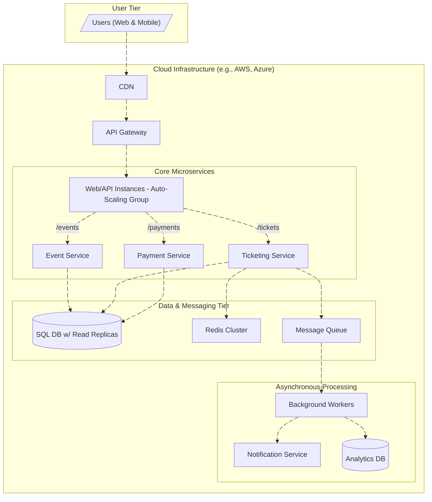
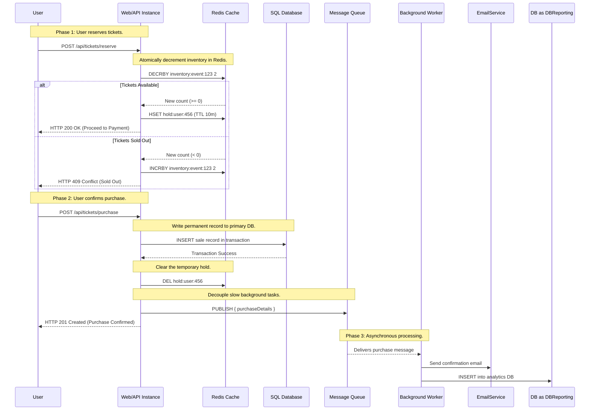

# Design: High-Traffic Ticketing Platform
This document outlines a robust and scalable architecture for a ticketing system designed to handle thousands of concurrent users. It leverages modern cloud services and advanced caching patterns to ensure high availability and a smooth user experience during peak demand.

----------

## 1. High-Level Architecture

The system is built on a **microservices architecture** deployed in the cloud, which is essential for achieving both scalability and fault tolerance. The design separates concerns into independent, auto-scaling services.

----------

## 2. Component Breakdown

-   **CDN (Content Delivery Network):** Serves static assets (HTML, CSS, JS, images) from edge locations close to users, drastically reducing latency.
-   **API Gateway:** Acts as the single, secure entry point. It handles request routing, rate limiting, and SSL termination.
-   **Auto-Scaling Group (Web/API Instances):** This is the core of our horizontal scaling strategy. It runs our stateless .NET Core services in containers. The number of instances automatically scales up or down based on traffic, ensuring we can handle sudden spikes.
-   **SQL Database (w/ Read Replicas):** A managed relational database (e.g., Amazon RDS, Azure SQL) serves as the system of record. The primary instance handles all writes (confirmed purchases), while one or more read replicas handle read-heavy queries like "Browse events." This is a mix of vertical and horizontal scaling.
-   **Redis Cluster:** More than just a simple cache, Redis is the high-performance engine for inventory management. It uses in-memory data structures to handle thousands of concurrent ticket reservation requests with sub-millisecond latency.
-   **Message Queue:** A durable queue (e.g., AWS SQS) decouples the fast, user-facing purchase confirmation from slower, background tasks. This prevents users from waiting for emails to send or analytics to update.
-   **Background Workers:** These are scalable compute services (e.g., AWS Lambda) that process messages from the queue asynchronously. They handle tasks like sending email confirmations, generating PDFs, and updating the analytics database.

----------

## 3. System Scaling Strategy

Our guiding principle is "**Horizontal Scaling First**," as it provides the elasticity and fault tolerance required for a high-traffic platform. Vertical scaling is used tactically for specific components.

### Stateless Services: Web/API Layer & Workers

-   **Method:** Horizontal Scaling.
-   **Implementation:** The stateless .NET services run in containers managed by an Auto-Scaling Group (e.g., in Kubernetes or AWS ECS).
-   **Triggers for Scaling Out (Adding Instances):**
    -   **CPU/Memory Utilization:** Scale out if average CPU exceeds 70% for 3 minutes.
    -   **Request Latency:** Scale out if the 95th percentile response time exceeds 500ms.
    -   **Queue Depth (for Workers):** The primary trigger for background workers. If the number of messages in the queue surpasses a threshold (e.g., 1000 messages), add more worker instances to process the backlog faster.
-   **Scaling In (Removing Instances):** The system scales down when these metrics fall below a certain threshold during off-peak hours, optimizing costs.

----------

## 4. Redis Caching & Inventory Strategy

A sophisticated caching strategy is critical to prevent the database from becoming a bottleneck and to avoid overselling tickets.

### Cache-Aside for Reads

-   **What:** Caching frequently accessed, rarely changing data like event details or seat maps.
-   **How:** The application first checks Redis for the data. If it's a cache miss, it queries the database, then populates Redis with the result and sets a Time-to-Live (TTL) before returning the data to the user. Subsequent requests will be a cache hit.

### Atomic Operations for Inventory Management (The Critical Part)

To handle thousands of users trying to buy tickets at once, we manage inventory directly in Redis to leverage its speed and atomic operations.

-   **Initialize Inventory:** The total available ticket count for an event is stored as an integer in Redis (e.g., `inventory:event:123`).
-   **Atomic Decrement:** When a user tries to reserve tickets, the application uses the `DECRBY` command. This operation is atomic, meaning it's a safe way to handle concurrency without race conditions.
-   **Temporary Hold:** If `DECRBY` is successful (the count is still `>= 0`), a temporary "hold" key is created in Redis for that user with a short TTL (e.g., 10 minutes). This reserves their spot.
-   **Release or Confirm:**
    -   If the user completes the purchase, the hold is deleted, and the sale is written to the SQL database.
    -   If the user abandons the cart, the hold key expires automatically. A background process listens for these expirations and uses `INCRBY` to add the tickets back to the available inventory.

### Virtual Waiting Room

For extremely high-demand events, a waiting room can be implemented using a Redis **Sorted Set**. Users are added to the set with their arrival timestamp as the score. A gatekeeper process allows a controlled number of users from the front of the queue to proceed, preventing the system from being overwhelmed.

----------

## 5. Ticket Purchase Sequence Diagram

This diagram illustrates the entire flow, showing the crucial role of Redis in ensuring a fast and reliable user experience.

